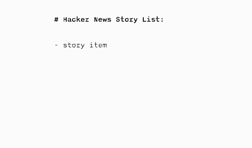
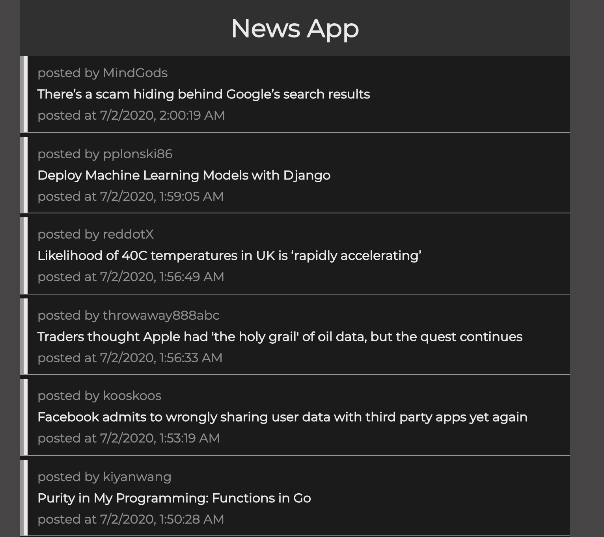

# Hacker News App

#### Problem

> Building a news reader app which displays the latest Hacker News stories. The app will leverage the Hacker News API to fetch the data it requires. 

## Requirements
> The app will be a single page web application with the following features:

> The app will display a list of the latest Hacker News stories in descending order from newest to oldest. 
> Each list item should show the title (which should link to the story), author name, and posted time.
> The targeted users for this app are exceptionally inpatient, so the app needs to display each story list item as soon as it has been fetched.  
> The app should support infinite scroll (like a social media feed). Specifically, when the user reaches the bottom of the page, the app should fetch earlier items and display them.
> The app should support offline capability. Specifically, the user should be able to use the app offline to check out the list.
> You can assume that the app will only be run on modern browsers, hence, feel free to use latest web spec.
> The resulting list will look like it is populating new items one-by-one, as seen below:

> 

#### Technology Used

> React, JavaScript, CSS, NPM and Enzyme.
> [Check out News App](https://michaelanokye.com/ "Link to News App").

## Landing Screen

> News app welcomes user to a screen with the lastest news
> from the Hacker News API.

> 

## Set up

Complete the following steps to start a new project (NEW-PROJECT-NAME):

1. Clone this repository to your local machine `git clone NEWS-APP-URL NEW-PROJECTS-NAME`
2. `cd` into the cloned repository
3. Make a fresh start of the git history for this project with `rm -rf .git && git init`
4. Install the node dependencies `npm install`
6. Edit the contents of the `package.json` to use NEW-PROJECT-NAME instead of `"name": "express-boilerplate",`

## Scripts

1. Start the application `npm start`

2. Run the tests `npm test`